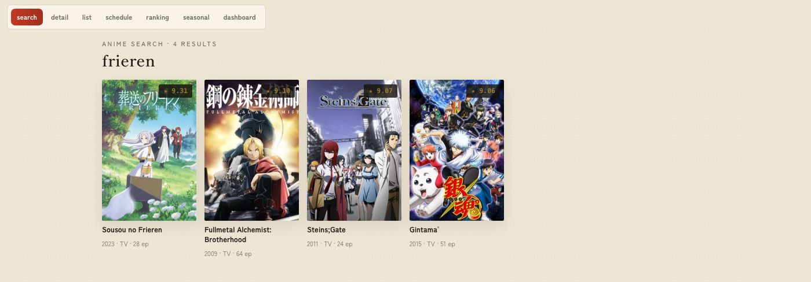
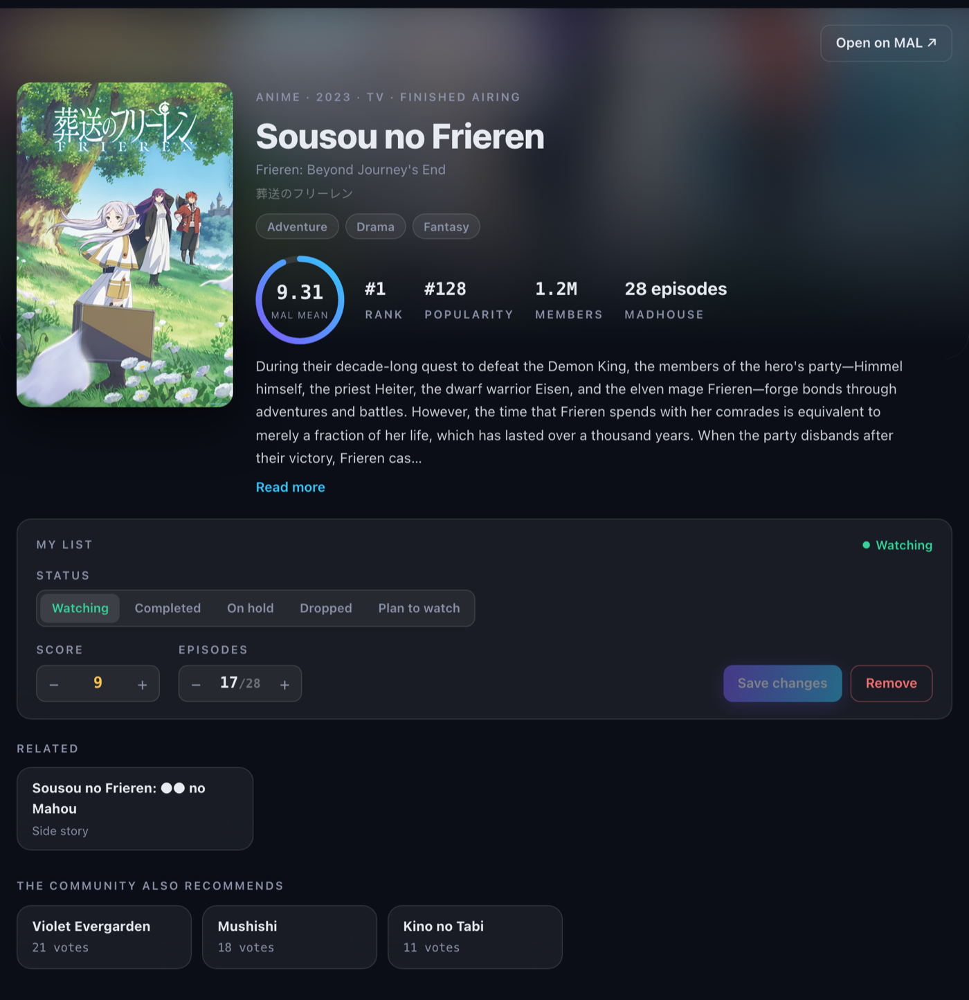
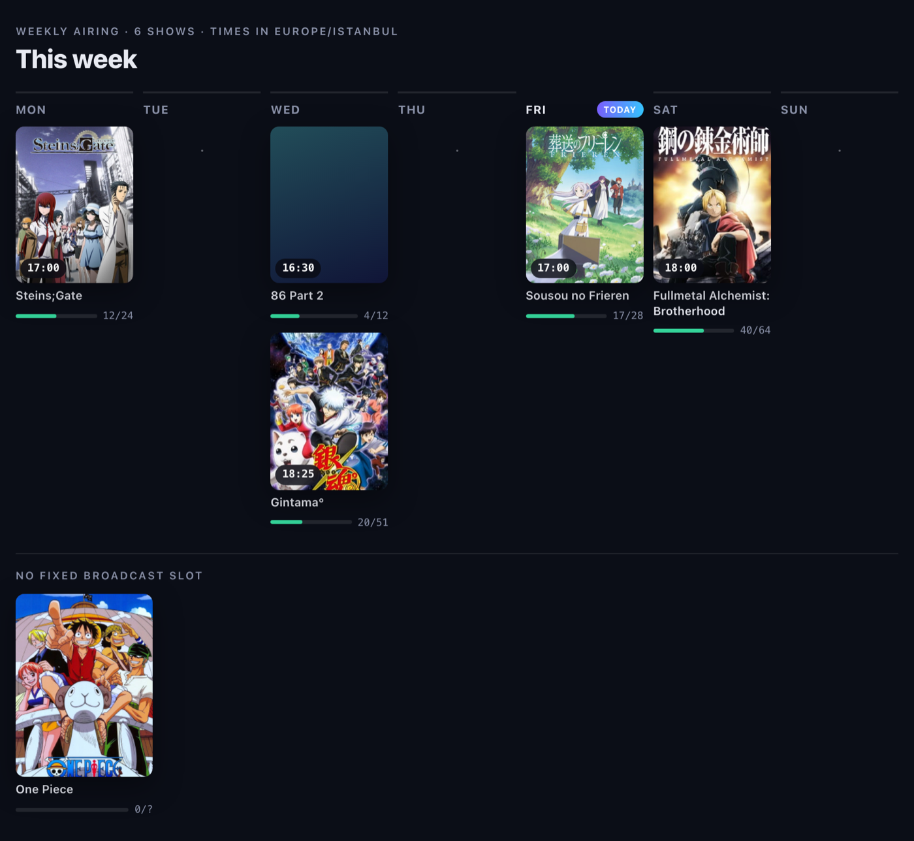
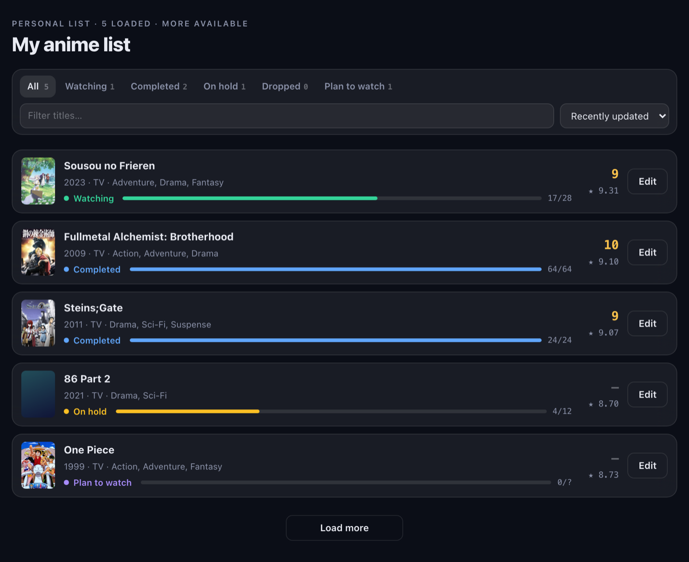
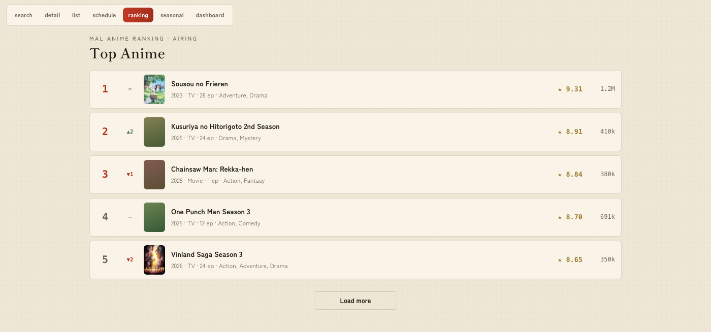
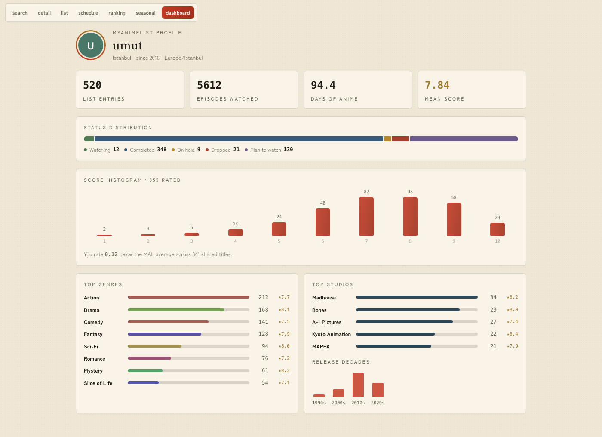

# mal-mcp

A **stateless** [MCP](https://modelcontextprotocol.io) server that exposes your
[MyAnimeList](https://myanimelist.net) data — watch list, scores, progress, rankings,
recommendations — as tools, plus a premium **[MCP Apps](https://github.com/modelcontextprotocol/ext-apps)
UI** that renders those results as an interactive, anime-styled interface right inside the
chat. Any assistant that speaks MCP can analyze your taste, browse seasons, and edit your
list; on hosts that support MCP Apps it does so through the UI below.

Python 3.12 · [FastMCP 3](https://gofastmcp.com) (streamable-HTTP) · React + Vite for the UI.

## The interface

On MCP Apps hosts (claude.ai / Claude Desktop, ChatGPT, VS Code, Goose, MCPJam…), each read
tool renders as a live view. The model still receives a compact text summary; the full data
travels to the iframe as structured content.







<table>
  <tr>
    <td width="50%"></td>
    <td width="50%"></td>
  </tr>
</table>



The detail and list views edit your MAL entries in place (status / score / progress) and
navigate between titles — all through the same tools, so nothing UI-only happens behind the
model's back. The theme follows the host's light/dark mode; cover art loads from MAL's CDN.

## Tools

**Anime**

| Tool | Description |
|------|-------------|
| `get_my_anime_list(status_filter?, sort?, limit=100, offset=0)` | A page of your list: title, cover, watch status, score, episode progress, genres, community mean, studios. |
| `get_user_stats()` | Locally computed summary: status/score/genre/media-type/decade distributions, total episodes, estimated watch time, user-vs-community score deviation, top studios. |
| `search_anime(query, limit=10)` | Public catalog search (compact results with covers, truncated synopsis). |
| `get_anime_detail(anime_id)` | Full public detail incl. related anime, recommendations, statistics, and your own list entry if present. |
| `analyze_taste()` | Token-efficient raw export of the whole list (grouped by status, sorted by score) for the calling model to analyze — this tool itself performs **no** analysis. |

**Manga**

| Tool | Description |
|------|-------------|
| `search_manga(query, limit=10)` | Public manga catalog search (chapters/volumes, authors, genres). |
| `get_manga_detail(manga_id)` | Full manga detail incl. authors, serialization magazines, related works, recommendations, and your own entry if present. |
| `get_my_manga_list(status_filter?, sort?, limit=100, offset=0)` | A page of your manga list with chapter/volume progress. |

**Discovery**

| Tool | Description |
|------|-------------|
| `get_anime_ranking(ranking_type, limit=25)` | MAL's official rankings: all, airing, upcoming, tv, ova, movie, special, bypopularity, favorite. |
| `get_manga_ranking(ranking_type, limit=25)` | Manga rankings: all, manga, novels, oneshots, doujin, manhwa, manhua, bypopularity, favorite. |
| `get_seasonal_anime(year, season, sort?, limit=25)` | Anime of one broadcast season (winter/spring/summer/fall). |
| `get_suggested_anime(limit=25)` | MAL's personalized suggestions for the authenticated user. |
| `get_weekly_schedule(timezone?)` | Your personal weekly airing calendar: the currently-airing anime on your `watching` list, grouped by broadcast day. JST by default, or converted to any IANA `timezone`. |

**Users**

| Tool | Description |
|------|-------------|
| `get_my_profile()` | Your profile + lifetime anime statistics. MAL exposes this only for `@me`. |
| `get_user_anime_list(user_name, ...)` | Another user's **public** anime list (403 usually = private list or unknown user). |
| `get_user_manga_list(user_name, ...)` | Another user's **public** manga list. |

**Write tools — these modify your MAL list**

| Tool | Description |
|------|-------------|
| `update_my_anime_entry(anime_id, ...)` | Update score/status/episode progress/tags — or add the anime to the list. Only provided fields change. |
| `delete_my_anime_entry(anime_id)` | **Permanently** remove an anime from the list (cannot be undone). |
| `update_my_manga_entry(manga_id, ...)` | Same as the anime variant, with chapter/volume progress. |
| `delete_my_manga_entry(manga_id)` | **Permanently** remove a manga from the list. |

Aggregate tools (`get_user_stats`, `analyze_taste`) fetch the entire list in one paginated
pass (safety cap: 20,000 entries — beyond that a `truncated`/WARNING marker is included).
`paging.next` URLs are validated (`https` + `api.myanimelist.net`) before being followed, so
the bearer token can never be sent elsewhere. Verified MAL API facts (fields syntax,
pagination, limits, error shapes) are documented in [NOTES.md](NOTES.md).

## Quick start

```bash
uv sync                          # install Python dependencies
uv run pytest                    # unit tests (pure helpers, no network)
uv run python -m mal_mcp.server  # serves http://0.0.0.0:8000/mcp (streamable-http)
```

Point an MCP client at `http://localhost:8000/mcp` (streamable HTTP) with an
`Authorization: Bearer <MAL access token>` header — see [Authentication](#authentication).

### Building the UI

The server runs without the UI bundle (it serves a small placeholder). To build the real
interface into the wheel/image:

```bash
cd ui
npm ci
npm run build   # emits src/mal_mcp/ui/dist/index.html (a single self-contained file)
```

For UI development without a host, `npm run dev` in `ui/` renders every view with fixture
data and a view switcher — the screenshots above are those views.

## Authentication

The server needs `Authorization: Bearer <MAL access token>` per request; it stores nothing.
Provide the token in one of three ways (this is the precedence order):

1. **`Authorization` header** — an MCP gateway or client sends the user's token per request.
2. **`MAL_REFRESH_TOKEN` (+ `MAL_CLIENT_ID`, `MAL_CLIENT_SECRET`)** — recommended for a
   single-account deployment. The server mints and renews access tokens itself via the
   OAuth `refresh_token` grant, in memory only. Set up once, no monthly re-pasting.
3. **`MAL_ACCESS_TOKEN`** — a static token (expires ~31 days); simplest for a quick test.

### Getting a MAL token

1. Create an API app at <https://myanimelist.net/apiconfig> → **Create ID**, **App Type: `Web`**
   (this is what makes MAL issue a Client Secret). Set the redirect URL to your OAuth
   callback, or a localhost URL like `http://localhost:8080/callback` for the manual flow.
2. MAL uses **`plain` PKCE only** (no `S256`), so the code verifier and challenge are the
   same string. Obtain a token once:

```bash
# 1) code verifier (43-128 chars); challenge == verifier for plain PKCE
VERIFIER=$(python3 -c "import secrets; print(secrets.token_urlsafe(64)[:100])")

# 2) open in a browser, log in, approve — you get ?code=<CODE> at your redirect URL:
#    https://myanimelist.net/v1/oauth2/authorize?response_type=code&client_id=<CLIENT_ID>&code_challenge=$VERIFIER&code_challenge_method=plain&state=x&redirect_uri=<URL_ENCODED_REDIRECT_URL>

# 3) exchange the code for tokens:
curl -s https://myanimelist.net/v1/oauth2/token \
  -d client_id=<CLIENT_ID> -d client_secret=<CLIENT_SECRET> \
  -d grant_type=authorization_code -d code=<CODE> \
  -d code_verifier=$VERIFIER -d redirect_uri=<REDIRECT_URL>
# → {"token_type":"Bearer","expires_in":2678400,"access_token":"...","refresh_token":"..."}
```

Keep the **`refresh_token`** for `MAL_REFRESH_TOKEN` (option 2), or the `access_token` for
the header/static options.

### Environment variables

| Variable | Default | Purpose |
|----------|---------|---------|
| `PORT` | `8000` | HTTP listen port |
| `HOST` | `0.0.0.0` | Bind address |
| `MAL_REFRESH_TOKEN` | *(unset)* | Enables self-renewing tokens via the `refresh_token` grant (needs `MAL_CLIENT_ID`). In-memory only. |
| `MAL_CLIENT_ID` | *(unset)* | MAL app Client ID, for the refresh grant. |
| `MAL_CLIENT_SECRET` | *(unset)* | MAL app Client Secret — required for "Web"-type apps. |
| `MAL_ACCESS_TOKEN` | *(unset)* | Static fallback token (expires ~31 days). |

## Docker

Prebuilt multi-arch image (the UI is built in the image):

```bash
docker run --rm -p 8000:8000 ghcr.io/umutkdev/myanimelist-mcp:latest
```

Or build locally:

```bash
docker build -t mal-mcp .
docker run --rm -p 8000:8000 mal-mcp
```

`python:3.12-slim` + uv, runs as a non-root user, exposes port 8000, serves `/mcp`. Because
the server is stateless (`stateless_http=True`), it scales freely behind any MCP gateway; the
gateway (or client) supplies the per-request `Authorization` header, or you provision a token
via the env vars above.

## Project layout

```
src/mal_mcp/
├── server.py       # FastMCP app, token helper, 20 tools, stats/format/summary helpers
├── mal_client.py   # MAL API wrapper: fields, pagination (paging.next), retries, error mapping
├── token_manager.py# self-renewing OAuth refresh_token grant (in-memory)
└── ui/             # MCP Apps layer: ui:// resource + meta/ToolResult helpers
    └── dist/       # built single-file HTML bundle (gitignored; built from ui/)
ui/                 # Vite + React + TypeScript app (motion animations, 6 views)
tests/              # offline unit tests (pure helpers, token manager, UI contract)
NOTES.md            # verified MAL API / FastMCP facts
```
